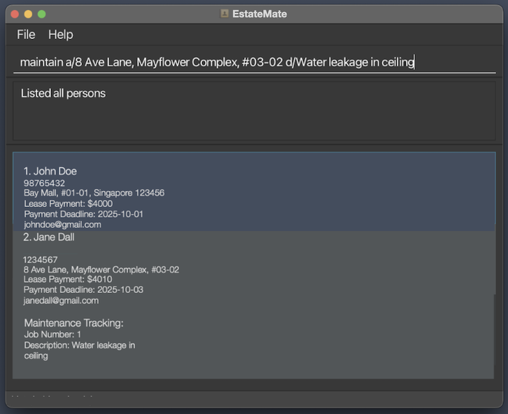

* EstateMate is **team project for CS2103T** 
* This project is based on the AddressBook-Level3 project created by the [SE-EDU initiative](https://se-education.org) 

* The project simulates an ongoing software project for a desktop application (called _EstateMate_) used for managing contact details.
  * It is **written in OOP fashion**. It provides a **reasonably well-written** code base **bigger** (around 6 KLoC) than what students usually write in beginner-level SE modules, without being overwhelmingly big.
  * It comes with a **reasonable level of user and developer documentation**.

* It is named `EstateMate` because it was initially created to help property managers manage their estates.
* For the detailed documentation of this project, see the **[EstateMate Product Website](https://ay2526s1-cs2103t-f08a-2.github.io/tp/)**.
* 